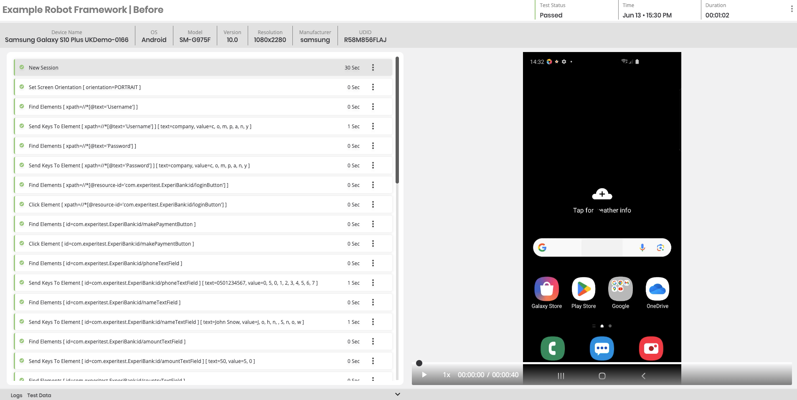
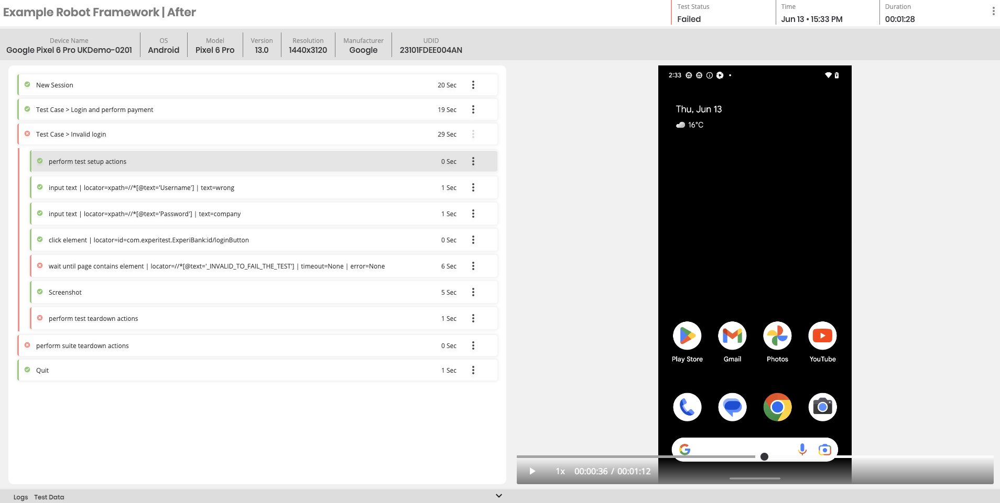
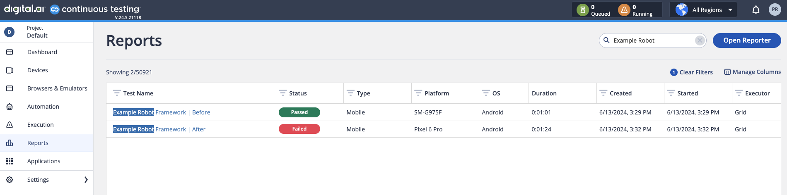

<h1>Example project boilerplate code for Robot Framework and Digital.ai's reporter integration.</h1>

<h2>Content</h2>
This repository is built using Robot Framework with Python, and is designed to run against Digital.ai's [Continuous Testing](https://digital.ai/products/continuous-testing) solution.  


The core structure of the project can be found in resources/daiMobileLibrary.py which handles many things such as the Appium Driver creation, but also a set of re-usable functions that can be incorporated throughout the Tests to ensure that the Test Results after the Test Execution is accurate and easy to use.  


Use the class resources/daiMobileLibrary.py as a starting point to build on top of.  


<h2>Examples </h2>
<h3>Here is an example of a Test Report before implementing Best Practices (pure Robot Framework)</h3>



<h3>Here is an example of a Test Report after implementing Best Practices (with Digital.ai library)</h3>



<h3>Here is an example of output on both tests on the Reports Page </h3>



<h2>Project file structure:</h2>
<ul>
    <li><b>resources/capabilities/</b> - holds example capabilities for devices: Android and iOS device, and Chrome browser</li>
    <li><b>resources/cloudCredentials.robot</b> - holds cloud credentials (cloud URL and access key)</li>
    <li><b>resources/daiMobileLibrary.py</b> - contains definitions, logic and keywords for DAI reporter</li>
    <li><b>steps/</b> - contains an extra layer of business logic (BDD)</li>
    <li><b>tests/</b> - contains tests files</li>
    <li><b>results/</b> - destination folder for test results</li>
</ul>

<h2>Setup</h2>
<h3>To install dependencies:</h3>
<code>pip install -r requirements.txt</code>
<h3>Setup of the tests, Cloud and Device configurations</h3>
After setting your Access Key and the URL for your environment in ```cloudCredentials.robot```, please set platformName and deviceQuery in ```appiumCapabilities.py```.

References to the various topics:

[Obtain your Access Key](https://docs.digital.ai/bundle/TE/page/obtain_your_access_key.html)

[Appium Capabilities](https://docs.digital.ai/bundle/TE/page/appium_oss_supported_capabilities.html)

[Device Query](https://docs.digital.ai/bundle/TE/page/device_queries.html)

<h2>Execution</h2>
To run test script in the command line:<br/>

<code>robo -d results/ tests/androidNativeApp.robot </code><br/>
<code>robo -d results/ tests/*</code>


<h2>Tests</h2>
<br>There are a few tests ready to run already<br/>
<ul>
    <li><b>tests/examples/daiFeatures.robot</b> - contains examples of Digital.ai features like measuring performance and voice assistance</li>
    <li><b>tests/examples/daiReporter.robot</b> - contains examples of tests to showcase reporter capabilities</li>
</ul>
<br/>
<br/>
<br/>
<i>This project is work in progress, please report any issues or suggest changes</i>
